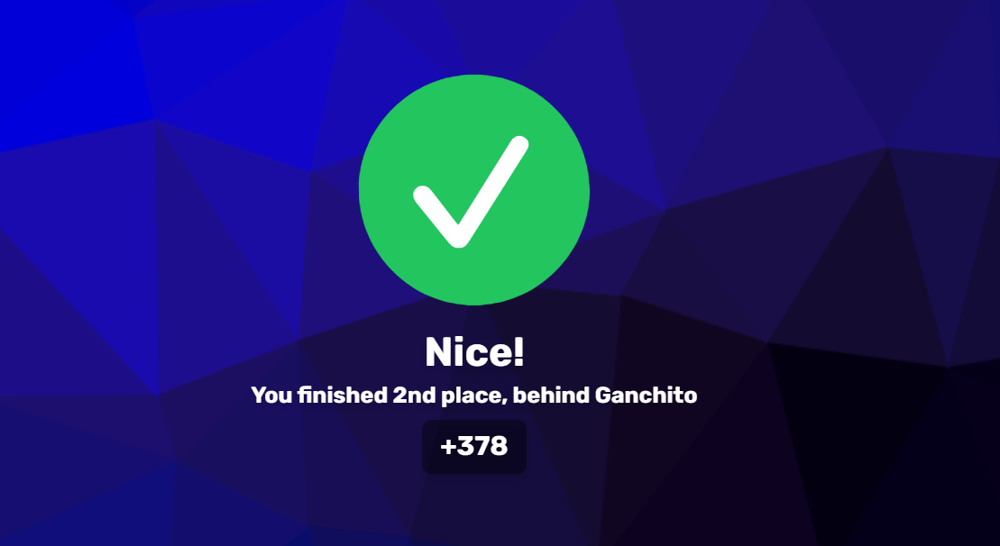
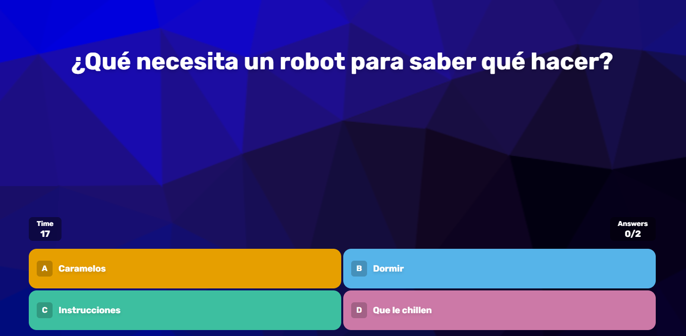
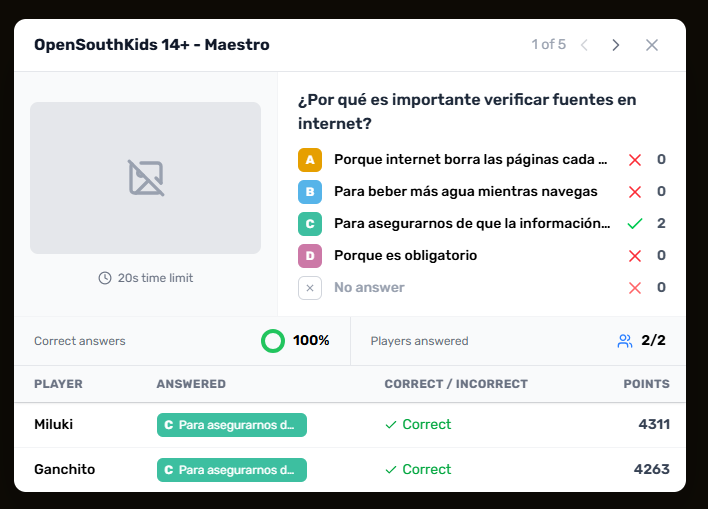

<p align="center">
  
  <br>
  <div align="center">
    
    
  </div>
</p>

## 🧩 What is this project?

OpenSouthQuiz is based on Razzia, a straightforward and open-source quiz platform that lets you host trivia games on your own server for small to medium events. Players join via their phones, answer questions in real time, and compete on a live leaderboard.

> **Disclaimer**: OpenSouthQuiz is an independent, open-source software project. It is not affiliated with, endorsed by, or sponsored by any third-party quiz platform or service. Any resemblance to other quiz platforms is purely incidental.

<p align="center">
  
  
  
</p>

## ✨ Features

- **Real-time multiplayer** — WebSocket-based communication for instant updates
- **Live leaderboard** — points, streaks, and rankings updated after every question
- **Persistent rankings** — game results are saved and aggregated into a global and per-quiz ranking panel
- **Multi-answer questions** — support for single and multiple correct answers
- **Media support** — images, videos, and audio attached to questions
- **Quiz editor** — create, edit, and delete quizzes from the manager dashboard
- **i18n** — available in English, Spanish, French, German, Italian, and Japanese
- **Persistent storage** — Docker deployment with optional persistent disk so results survive restarts
- **Lightweight** — single container with nginx + Node.js, easy to deploy on Render, Fly.io, or any VPS

## ⚙️ Prerequisites

Choose one of the following deployment methods:

### Without Docker

- Node.js : version 22 or higher
- PNPM : version 10.16 or higher (learn more [here](https://pnpm.io/))

### With Docker

- Docker and Docker Compose (for production)
- Or any container runtime that supports Dockerfiles (Render, Fly.io, etc.)

## 📖 Getting Started

Choose your deployment method:

### 🐳 Using Docker (Recommended)

Using Docker Compose (recommended):
You can find the docker compose configuration in the repository:
[docker-compose.yml](/compose.yml)

```bash
docker compose up -d
```

Or using Docker directly:

```bash
docker run -d \
  -p 3000:3000 \
  -v ./config:/app/data \
  ralex91/razzia:latest
```

**Configuration Volume:**
The `-v ./config:/app/data` option mounts a local `config` folder to persist your game settings, quizzes, and ranking results. This allows you to:

- Edit your configuration files directly on your host machine
- Keep your settings and results when updating the container
- Easily backup your quizzes, game configuration, and player rankings

The folder will be created automatically on first run with an example quiz to get you started.

The application will be available at http://localhost:3000

### ☁️ Cloud Deployment

The repository includes deployment configurations for popular cloud platforms:

- **Render** — `render.yaml` (Blueprint-ready, supports persistent disk on Starter plan)
- **Fly.io** — `fly.toml` (native WebSockets, auto-stop/start to save resources)

See [DEPLOY.md](/DEPLOY.md) for step-by-step deployment instructions.

### 🛠️ Without Docker

1. Clone the repository:

```bash
git clone https://github.com/Ralex91/OpenSouthQuiz.git
cd ./OpenSouthQuiz
```

2. Install dependencies:

```bash
pnpm install
```

3. Build and start the application:

```bash
# Development mode
pnpm run dev

# Production mode
pnpm run build
pnpm start
```

## ⚙️ Configuration

The configuration is split into two main parts:

### 1. Game Configuration (`config/game.json`)

Main game settings:

```json
{
  "managerPassword": "PASSWORD"
}
```

Options:

- `managerPassword`: The master password for accessing the manager interface. **Must be changed from the default `"PASSWORD"` value**, otherwise manager access is blocked.

### 2. Quiz Configuration (`config/quizz/*.json`)

Quizzes can be created in two ways:

- **Via the Quiz Editor** — use the built-in editor available in the manager dashboard (recommended)
- **Via JSON files** — manually create files in the `config/quizz/` directory

You can have multiple quiz files and select which one to use when starting a game.

Example quiz configuration (`config/quizz/example.json`):

```json
{
  "subject": "Example Quiz",
  "questions": [
    {
      "question": "What is the correct answer?",
      "answers": ["No", "Yes", "No", "No"],
      "solutions": [1],
      "cooldown": 5,
      "time": 15
    },
    {
      "question": "Which of these are primary colors?",
      "answers": ["Red", "Green", "Blue", "Yellow"],
      "solutions": [0, 2, 3],
      "cooldown": 5,
      "time": 20
    },
    {
      "question": "What is the correct answer with an image?",
      "answers": ["No", "Yes", "No", "No"],
      "media": {
        "type": "image",
        "url": "https://placehold.co/600x400.png"
      },
      "solutions": [1],
      "cooldown": 5,
      "time": 20
    }
  ]
}
```

Quiz Options:

- `subject`: Title/topic of the quiz
- `questions`: Array of question objects containing:
  - `question`: The question text
  - `answers`: Array of possible answers (2-4 options)
  - `media`: Optional media object displayed with the question:
    - `type`: `"image"`, `"video"`, or `"audio"`
    - `url`: URL of the media
  - `explanation`: Optional explanation shown after the answer is revealed
  - `solutions`: Array of correct answer indices (0-based). Use multiple indices for multi-answer questions
  - `cooldown`: Time in seconds before answers are revealed (3-15)
  - `time`: Time in seconds allowed to answer (5-120)

### 3. Results and Rankings

Game results are automatically saved to the persistent storage directory. The manager dashboard includes a **Ranking** panel that shows:

- **Global ranking** — aggregated points across all quizzes per player
- **Per-quiz ranking** — expandable breakdown for each quiz
- **Summary stats** — total games played, total player entries

Players are identified by `username + random playerId` to avoid name collisions.

## 🎮 How to Play

1. Access the manager interface at http://localhost:3000/manager
2. Enter the manager password (defined in `config/game.json`)
3. Share the game URL (http://localhost:3000) and room code with participants
4. Wait for players to join
5. Click the start button to begin the game

### Manager Controls

- **Start / advance questions** — control the game flow
- **Show leaderboard** — display current standings to players
- **Next question** — skip to the next question
- **Abort quiz** — end the current game early
- **Kick player** — remove a disruptive player
- **Quiz editor** — create and manage quizzes from the dashboard
- **Results** — browse past game results with detailed question breakdowns
- **Ranking** — view global and per-quiz player rankings (persistent across games)

## 🏗️ Architecture

```
packages/
├── common/          # Shared types, constants, and validators
├── socket/          # WebSocket server (game logic, player management)
└── web/             # React frontend (Vite + Tailwind)

docker/
├── nginx.conf       # Reverse proxy config
├── supervisord.conf # Process manager config
└── entrypoint.sh    # Config seeding on first boot

config/
├── game.json        # Game settings (manager password)
└── quizz/           # Quiz files (one per quiz)
```

The server (`packages/socket`) handles WebSocket connections, game state, and persistence. The frontend (`packages/web`) renders the player and manager UIs. Shared code lives in `packages/common`.

## 📝 Contributing

Contributions are welcome! Please read the [CONTRIBUTING.md](.github/CONTRIBUTING.md) guide before submitting a pull request.

For bug reports or feature requests, please [create an issue](https://github.com/Ralex91/OpenSouthQuiz/issues).

## ⭐ Star History

[](https://www.star-history.com/#Ralex91/OpenSouthQuiz&type=date&legend=bottom-right)
